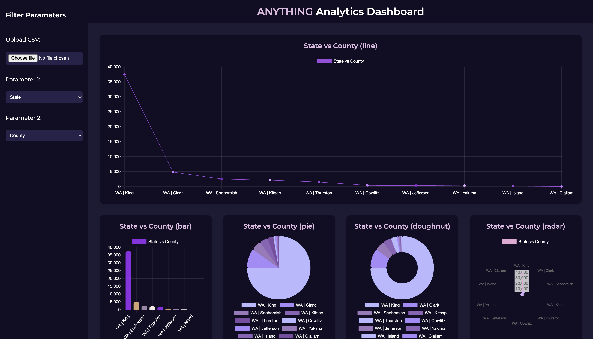

# 📊 Analytics Dashboard

 <!-- Replace with your own image link or local image path -->

An interactive and responsive analytics dashboard built with **HTML**, **CSS**, and **JavaScript**. It visualizes data from a CSV file using multiple chart types powered by [Chart.js](https://www.chartjs.org/) and supports dynamic filtering by user-selected parameters.

---

## ✨ Features

- 📁 **CSV Upload**: Upload your own CSV file to visualize data.
- 🎯 **Dynamic Filters**: Choose two parameters from the CSV to analyze.
- 📈 **Chart Types**:
  - Line Chart
  - Bar Chart
  - Pie Chart
  - Doughnut Chart
  - Radar Chart
  - Scatter Plot
  - Area Chart
  - Gauge Chart (using doughnut + plugin)
- 🌙 **Dark Mode Theme**: Beautiful dark-themed UI with pastel accents.
- 📱 **Responsive Design**: Optimized for mobile, tablet, and desktop views.

---
